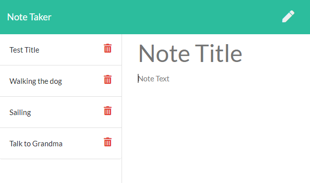

# Note-Taker-Express

### Designer Name
* Jonah Haase	

## Project Description
* Modify starter code to create an application called Note Taker that can be used to write and save notes. This application will use an Express.js back end and will save and retrieve note data from a JSON file.

## User Story

```
AS A small business owner
I WANT to be able to write and save notes
SO THAT I can organize my thoughts and keep track of tasks I need to complete
```

# Table of Contents
1. [Project Installation](#project-installation)
2. [Mock Up](#mock-up)
3. [Links](#links)
4. [Questions](#questions)

## Project Installation
* Install NPM's: Inquirer, Jest

## Mock-Up

The following images show the web application's appearance and functionality: 



## Links
* Deployment: https://jojonah1812.github.io/Note-Taker-Express.js/
* GitHub: https://github.com/jojonah1812/Note-Taker-Express.js


## Questions
If you have any questions, please feel free to contact me through my GitHub account or my email address.

* #### GitHub Username    jojonah1812	
* #### GitHub Link    https://github.com/jojonah1812
* #### Email    jojonah@gmail.com
